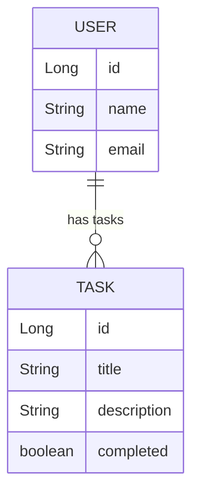

# API RESTful em Java com Spring Boot
Esta é uma API RESTful em Java construída com Spring Boot que permite gerenciar usuários e suas tarefas. A API fornece endpoints para criar, ler, atualizar e excluir usuários, bem como para gerenciar tarefas associadas a cada usuário.

## Tecnologias Utilizadas
- Java 22
- Spring Boot 3.3.1
- OpenAPI 2.1.0
- H2 Database
- Maven 4.0.0

## Diagrama de Classes:

## Endpoints da API:

### Usuários:

#### _Criar Usuário_

POST `/users`

    {
    "name": "John Smith",
    "email": "john.smith@example.com"
    }

#### _Buscar Todos os Usuários_

GET `/users`

#### _Buscar Usuário por ID_

GET `/users/{userId}`

#### _Atualizar Usuário_

PUT `/users/{userId}`

    {
    "name": "Jane Smith",
    "email": "jane.smith@example.com"
    }

#### _Deletar Usuário_

DELETE `/users/{userId}`

### Tarefas:

#### _Adicionar Tarefa a um Usuário_

POST `/users/{userId}/tasks`

    {
    "description": "Complete the project",
    "completed": false
    }

#### _Atualizar Tarefa de um Usuário_

PUT `/users/{userId}/tasks/{taskId}`

    {
    "description": "Complete the project",
    "completed": true
    }

